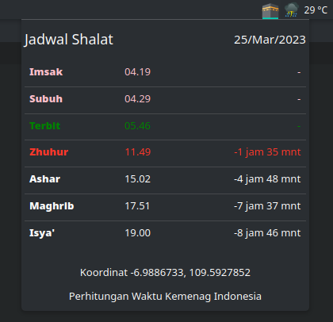

# Usalli

A Plasmoid for showing Islamic prayer times schedule. Work with KDE Plasma Framework >= 5.92.

## Requirements

### Kubuntu 22.04

```
sudo apt install qml-module-org-kde-kconfig qml-module-org-kde-notification
```

### Fedora 37 KDE

```
sudo dnf install kf5-kconfig kf5-knotifications kf5-ki18n
```

## Installing

Build manually with CMake.

### Build Requirements

**Kubuntu 22.04**

```
sudo apt install cmake extra-cmake-modules gettext g++ qml-module-org-kde-kconfig qml-module-org-kde-notification libkf5config-dev libkf5i18n-dev libkf5plasma-dev libkf5notifications-dev plasma-workspace-dev
```

**Fedora 37 KDE**

```
sudo dnf install cmake extra-cmake-modules plasma-workspace-devel kf5-kconfig-devel kf5-knotifications-devel kf5-plasma-devel kf5-ki18n-devel
```

Then run following commands from project directory. Change `<your_username>` with your Linux user name.

```
mkdir build && cd build
cmake -DCMAKE_INSTALL_PREFIX=/home/<your_username>/.local ..
make install
```

## Install Manually

Download this repo as ZIP, then extract it.
Then copy folder `package` to `/home/<your_username>/.local/share/plasma/plasmoids` and rename it to `id.aryos.usalli`.

If you prefer CLI, run these commands

```
# for instance the extracted folder is in /home/user/Downloads
cd ~/Downloads/plasma-applet-usalli-master
mv package id.aryos.usalli
cp -r id.aryos.usalli ~/.local/share/plasma/plasmoids/
```

Also copy the SVG icon inside the folder `package/contens/icons` to `/home/<your_username>/.local/icons`.

With CLI

```
# folder package has been previously renamed
cp id.aryos.usalli/contents/icons/*.svg ~/.local/icons/
```

Then you can add the widget to KDE Plasma.



## To Do List

- [x] Adjust calculation
- [x] Time remaining
- [x] Adjust row alignment
- [x] Adjust isya show next day
- [x] Highlight next prayer
- [x] Tooltip next prayer
- [x] Add imsak time
- [x] Config location
- [x] Config show imsak
- [x] Notification popup
- [x] Custom icon
- [ ] Add dhuha time: 15+ sunrise & 15- dhuhr
- [ ] Tooltip hijri calendar
- [ ] Show hijri calendar
- [ ] Config show next prayer label rather than icon in task bar
- [ ] Config others: madhab, calculation method
- [ ] Config adjust hijri day
- [ ] Get kde geolocation data / gmaps api get lang lot search city
- [ ] Play adzan / Alarm
- [ ] Show next / previous day button
- [ ] Imsakiyah schedule
- [ ] Linux packaging
- [ ] Internationalization

## License

Please refer to LICENSE file.
